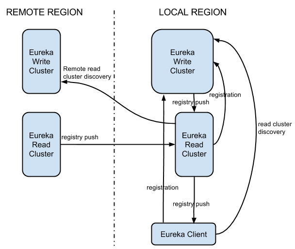
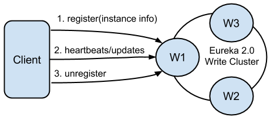
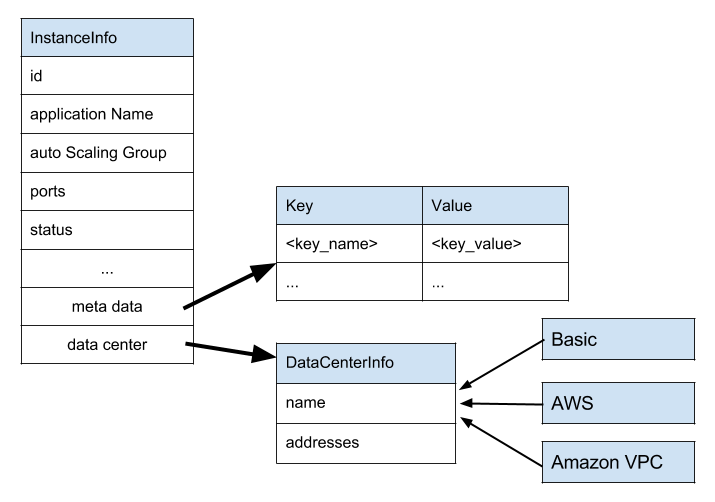

```
WORK IN PROGRESS.
Eureka 2.0 is still under active development, and there might be 
updates to its architecture/public API.
```

# Architecture Overview

Eureka 2.0 is a service discovery framework designed for cloud deployments. It is an evolution of the original 1.0
version, which aims to be much more scalable, and replace the pull based model with fine grain subscription model.

The figure below shows the primary components in a typical Eureka 2.0 deployment. Eureka system itself consists of
a write and read cluster. The write cluster is a stateful subsystem, which handles client registrations and
maintains internal service registry. The registry content is replicated between the all write server nodes in
an eventually consistent manner. The write cluster's registry content is read by the read cluster, that ultimately
is used by the Eureka clients. As the read cluster is effectively a cache layer, it can
 be easily, and rapidly scaled up and down depending on the volume of the traffic. The write cluster should be pre-scaled with a capacity enough to handle the peek/busy hour traffic. Although it can be scaled up and down dynamically, it needs to be done with more coordination. Scaling up will require traffic re-balancing, which will eventually happen, but not immediately. Scaling down will force the clients from the shutdown node(s) to re-register.



## Client registration

Eureka clients can register themselves to be discoverable via registration, heartbeats and updates.
Registrations include discoverable identifiers and service status, as well as optional freeform metadata. Eureka 2.0 servers responsible for handling these actions form the write cluster.



A single client can register multiple service instances. Each registration is handled over a separate connection to the write server, as the connection status itself denotes the service liveness. Software heartbeats at the Eureka level is used to determine connection liveness as network stacks in virtualized environments are not 100% trustworthy. If a connection is lost, the registration entry in the write cluster registry is put into the eviction queue, and ultimately remove from the registry. Well behaving clients should always send unregister request prior to disconnecting. This will result in immediate removal of the service from the registry.
After the registration, the client can send any number of update requests, changing its instance data. One usage example would be modification of the service status (up/down).

## Registry discovery

Eureka clients can subscribe to interest sets on Eureka servers. After a successful subscription, all changes to
subscribed interests are pushed by the server to the client. Eureka servers responsible for handling these actions form the read cluster.


## Service registry data model

Eureka 2.0 is designed to work with different cloud providers and data centers, thus its underlying data model must be extendable to accommodate current and future deployments. Out of the box a basic data center model, and Amazon AWS/VPC clouds are supported.



The predefined set of service instance attributes can be extended via custom set of key/value pairs that can be added to metadata map. The network topology is not predefined, and is concretized by cloud specific extensions. Thus simple public/private IP model is provided for AWS deployment, but multi NIC/ENI support is supported for VPC.

## Interest subscription model

A subscription model consists of a set of predefined atomic interest classes:
 
* application interest - all service instances belonging to a given application
* vip interest - all service instances belonging to a particular eureka virtual address (vip)
* instance id - a specific instance with a given id
* full registry - a special interest type denoting all entries in the registry (should be rarely used as may generate huge traffic for large registries)

The application/vip/instance id interests have an associated operator, which allowed values are:

* _Equals_ - match exactly the provided value
* _Like_ - treat interest value as a regular expression

The atomic interests can be combined into composite structures with logical _OR_ semantic. For example, lets assume that we are interested in 'eureka_write', 'eureka_read' and 'atlas' applications. We could subscribe to all of them with the following composite interest:

_application("eureka.*", Operator.Like) OR application("atlas", Operator.Equals)_

which using Eureka client API translates to:

```java
Interests.forSome(
    Interests.forApplications(Operator.Like, "eureka.*"), 
    Interests.forApplications(Operator.Equals, "atlas")
);
```

# Dashboard

Eureka 2.0 Dashboard is an optional component, for overall Eureka cluster management/monitoring. It provides cluster level view, with means to drill down to a specific server instance for easy troubleshooting/system diagnosis.

# CAP theorem

From CAP theorem perspective, Eureka write cluster is an AP system (highly available, and partition tolerant).
This choice is driven by the primary requirements of a cloud based discovery service. In the cloud, especially
for large deployments, the failures happen all the time. This could be failure of a Eureka server itself, the registered clients or a network partition. Under all those circumstances, Eureka remains to be available by providing registry information and accepting new registrations from each available node in isolation. Since, Eureka chooses availability, the data in such a scenario is not consistent between these nodes. Since this model causes that there is always some level of staleness of the registry data, it should be complemented
by proper client side load balancing and failover mechanisms. In Netflix ecosystem these features are provided
by [Ribbon](https://github.com/Netflix/ribbon).